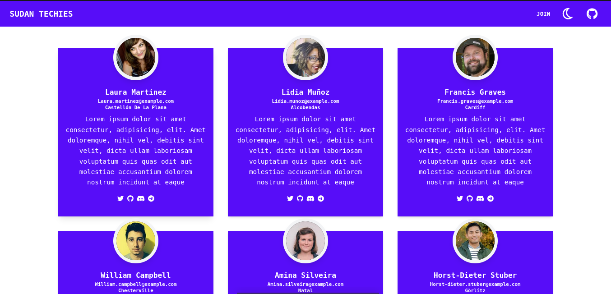
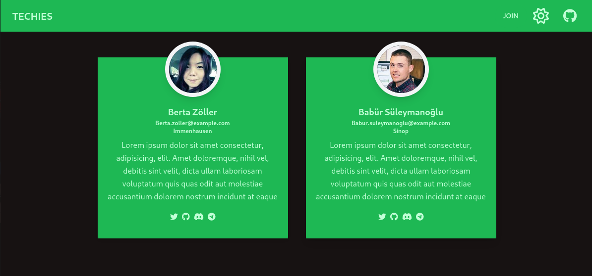
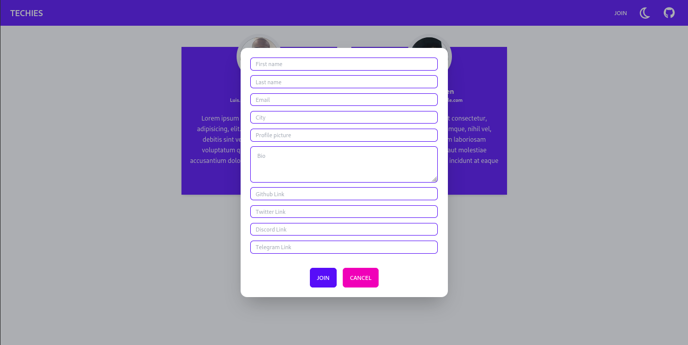
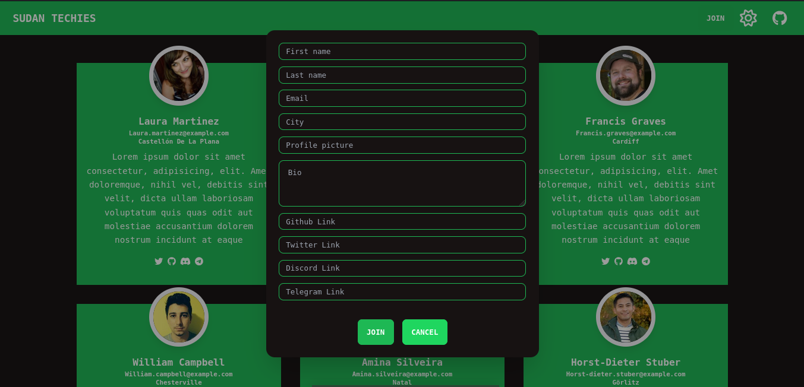

## Installation

```
git clone https://github.com/arashi-u/tehcies.git
cd techies
npm i
npm run dev
```

### About

This is a simple web application i've been working on to enhance my skills on the MERN stack which stands for MongoDB, Express, React and Node.
It's not fully completed you can checkout the backend api at [techies-api](https://github.com/arashi-u/techies-api).

### Screenshots

#### Light mode


#### Dark mode


#### Light mode modal


#### Dark mode modal

